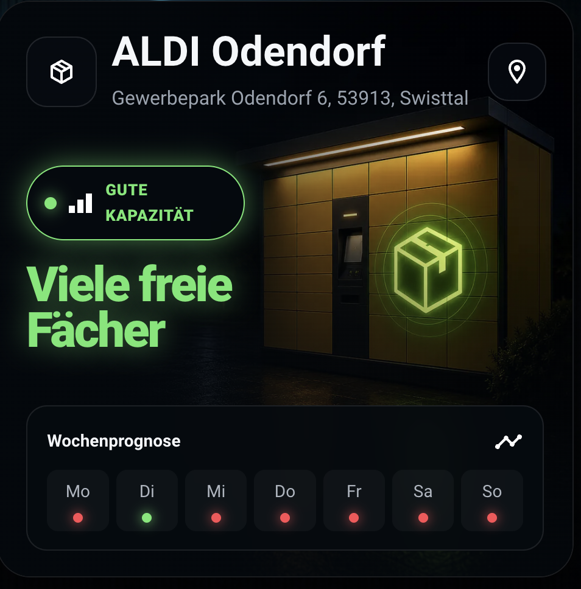
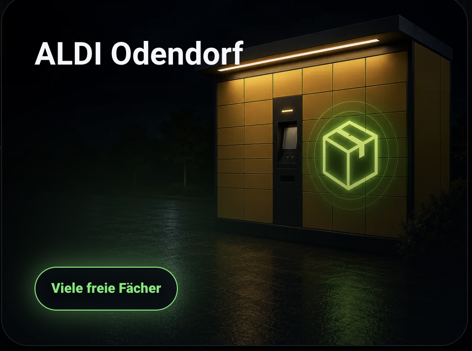
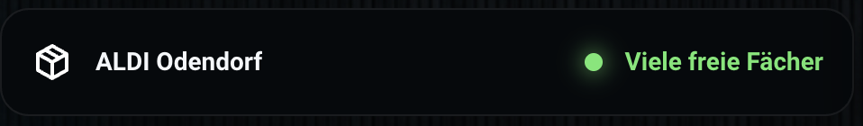

# DHL Packstation Capacity

[](https://github.com/loungelizard2018/ha-dhl-packstation/actions/workflows/hacs.yml)
[](https://github.com/loungelizard2018/ha-dhl-packstation/actions/workflows/hassfest.yml)
[](https://github.com/loungelizard2018/ha-dhl-packstation/releases)
[](LICENSE)

Home Assistant custom integration for the statistical Packstation capacity forecast provided by the official DHL Location Finder API.

> [!IMPORTANT]
> DHL does **not** expose a live fill level. The API supplies weekday-based statistical forecasts derived from previous weeks.

## Features

- Official DHL Location Finder API
- Configuration through Home Assistant's UI
- Multiple Packstations supported
- Forecast for today plus seven weekday entities
- Localized states in German and English
- Last successful update sensor
- Manual refresh button
- Three bundled Lovelace layouts: `full`, `compact` and `row`
- No dependency on `button-card` or `card-mod`

## Installation with HACS

1. Open HACS.
2. Open **Custom repositories**.
3. Add `https://github.com/loungelizard2018/ha-dhl-packstation` as category **Integration**.
4. Download the latest release.
5. Restart Home Assistant completely.
6. Open **Settings → Devices & services → Add integration**.
7. Search for **DHL Packstation Capacity**.

## Obtain a DHL API key

This integration requires a free DHL Developer API key.

1. Create or sign in to a [DHL Developer account](https://developer.dhl.com/).
2. Create an application in the DHL Developer Portal.
3. Subscribe the application to the **Location Finder API**.
4. Copy the generated API key.
5. Enter the key during integration setup in Home Assistant.

Official documentation: [DHL Location Finder API](https://developer.dhl.com/api-reference/location-finder)

The API key is sent only to DHL. Home Assistant diagnostics redact it.

## Configuration

The setup dialog asks for:

- DHL API key
- country code, normally `DE`
- postal code
- Packstation number
- optional display name

The values are validated against DHL before they are saved. Open the integration entry and select **Configure** to change the station, display name, API key or update interval later.

## Entities

Each configured Packstation creates ten entities:

| Entity | Purpose |
|---|---|
| Capacity forecast today | Forecast for the current local weekday |
| Forecast Monday | Monday forecast |
| Forecast Tuesday | Tuesday forecast |
| Forecast Wednesday | Wednesday forecast |
| Forecast Thursday | Thursday forecast |
| Forecast Friday | Friday forecast |
| Forecast Saturday | Saturday forecast |
| Forecast Sunday | Sunday forecast |
| Last update | Timestamp of the last successful DHL request |
| Refresh now | Manual API refresh |

Entity IDs are generated by Home Assistant and can differ between installations. Use the entity marked with the attribute `data_type: average_capacity_by_weekday` for the Lovelace card.

### Forecast states

| Internal state | English UI | German UI | Card color |
|---|---|---|---|
| `high` | Many free compartments | Viele freie Fächer | Green |
| `low` | Few free compartments | Wenige freie Fächer | Yellow |
| `very_low` | Almost full | Fast voll | Red |
| `unknown` | No forecast | Keine Prognose | Gray |

## Lovelace card

The integration bundles `custom:dhl-packstation-card` and registers it as a JavaScript module.

### Full view

```yaml
type: custom:dhl-packstation-card
entity: sensor.your_packstation_capacity_forecast_today
view: full
```

Optional map button and custom title:

```yaml
type: custom:dhl-packstation-card
entity: sensor.your_packstation_capacity_forecast_today
view: full
name: Packstation Odendorf
show_map: true
```

### Compact view

```yaml
type: custom:dhl-packstation-card
entity: sensor.your_packstation_capacity_forecast_today
view: compact
```

### Row view

```yaml
type: custom:dhl-packstation-card
entity: sensor.your_packstation_capacity_forecast_today
view: row
show_status_text: true
```

Hide the text and keep only the colored status indicator:

```yaml
type: custom:dhl-packstation-card
entity: sensor.your_packstation_capacity_forecast_today
view: row
show_status_text: false
```

The card automatically falls back to the correct current-day entity if an older dashboard still references one of the weekday entities from a previous prerelease.

## Automation example

```yaml
alias: Packstation forecast is good
triggers:
  - trigger: state
    entity_id: sensor.your_packstation_capacity_forecast_today
    to: high
actions:
  - action: notify.mobile_app_your_phone
    data:
      title: Packstation
      message: DHL forecasts many free compartments today.
mode: single
```

## Card resource troubleshooting

If Home Assistant reports `Custom element doesn't exist: dhl-packstation-card`, verify that this JavaScript module exists under **Settings → Dashboards → Resources**:

```text
/dhl_packstation_static/dhl-packstation-card.js?v=<installed-version>
```

After updating:

1. Restart Home Assistant completely.
2. Hard-refresh the browser.
3. Close and reopen the mobile app.
4. Remove obsolete duplicate resources referencing older versions.

## Existing entity names after an upgrade

Home Assistant can retain names or entity IDs from an earlier prerelease in its entity registry. The integration keeps stable unique IDs, so automations continue to work. To restore the integration-provided name, open the entity settings and clear any manually stored name.

## Privacy and limitations

- No live compartment occupancy is available through this API.
- Forecast quality and available weekdays are controlled by DHL.
- No analytics or telemetry are included.
- This project is independent and is not affiliated with or endorsed by DHL.

## Support

Use [GitHub Issues](https://github.com/loungelizard2018/ha-dhl-packstation/issues) for reproducible defects and feature requests. Never publish an API key in an issue, screenshot or manually pasted diagnostic.

## License

MIT
