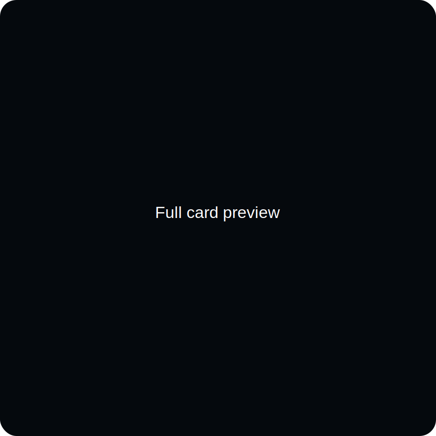
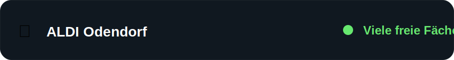

# DHL Packstation Capacity

Home Assistant custom integration for the DHL Location Finder capacity forecast.

> The DHL API provides a weekday-based statistical forecast derived from previous weeks. It is **not** a live fill level.

## Features

- Configuration through **Settings → Devices & services**
- Multiple Packstations supported
- API key, country, postal code, Packstation number and display name configurable
- Configurable polling interval
- Current-day capacity sensor
- Seven individual weekday forecast sensors
- Last successful update timestamp
- Manual refresh button
- Bundled Lovelace card with three layouts
- German and English translations
- No dependency on `button-card` or `card-mod`

## Installation with HACS

1. Open HACS.
2. Open the menu and select **Custom repositories**.
3. Add `https://github.com/loungelizard2018/ha-dhl-packstation`.
4. Select category **Integration**.
5. Download the latest release.
6. Restart Home Assistant.
7. Open **Settings → Devices & services → Add integration**.
8. Search for **DHL Packstation Capacity**.


## DHL API key

This integration requires a free DHL Developer API key.

1. Create a DHL Developer account:
   https://developer.dhl.com/

2. Create an application.

3. Subscribe to the **Location Finder API**.

4. Generate an API key.

5. Copy the API key into the Home Assistant integration setup.

More information:
https://developer.dhl.com/api-reference/location-finder

## Configuration

The setup dialog asks for:

- DHL API key
- country code, normally `DE`
- postal code
- Packstation number
- optional display name

The integration validates the values against DHL before saving them.
After setup, open the integration entry and select **Configure** to change:

- API key
- country code
- postal code
- Packstation number
- display name
- update interval

## Entities

Each configured Packstation creates:

| Entity | Purpose |
|---|---|
| Capacity forecast today | Forecast for the current local weekday |
| Forecast Monday | Monday forecast |
| Forecast Tuesday | Tuesday forecast |
| Forecast Wednesday | Wednesday forecast |
| Forecast Thursday | Thursday forecast |
| Forecast Friday | Friday forecast |
| Forecast Saturday | Saturday forecast |
| Forecast Sunday | Sunday forecast |
| Last update | Timestamp of the last successful DHL request |
| Refresh now | Manual API refresh button |

Possible forecast values:

| DHL value | Meaning | Card color |
|---|---|---|
| `high` | Many free compartments | Green |
| `low` | Few free compartments | Yellow |
| `very-low` | Almost full | Red |
| `unknown` | No forecast available | Gray |

## Lovelace card

The integration bundles `custom:dhl-packstation-card` and registers it as a JavaScript module.

Use the actual capacity entity id from **Developer tools → States**.

### Full view

The full view displays the location, current forecast, status background and complete weekly forecast.



```yaml
type: custom:dhl-packstation-card
entity: sensor.aldi_odendorf_capacity_forecast_today
view: full
```

### Compact view

The compact view keeps the station graphic, station name and current forecast, but removes the weekly details.


```yaml
type: custom:dhl-packstation-card
entity: sensor.aldi_odendorf_capacity_forecast_today
view: compact
```

### Row view

The row view is intended for dense dashboards and shows the station name plus forecast indicator in a single line.



```yaml
type: custom:dhl-packstation-card
entity: sensor.aldi_odendorf_capacity_forecast_today
view: row
show_status_text: true
```

Hide the status text and keep only the colored indicator:

```yaml
type: custom:dhl-packstation-card
entity: sensor.aldi_odendorf_capacity_forecast_today
view: row
show_status_text: false
```

## Card resource troubleshooting

If Home Assistant reports:

```text
Custom element doesn't exist: dhl-packstation-card
```

check **Settings → Dashboards → Resources**. The resource should exist as a JavaScript module:

```text
/dhl_packstation_static/dhl-packstation-card.js?v=<installed-version>
```

After an update:

1. Restart Home Assistant completely.
2. Hard-refresh the browser.
3. Close and reopen the mobile app if required.

## Forecast attributes

The main sensor also exposes normalized attributes for custom dashboards and automations:

```yaml
capacity_today: high
current_weekday: Tuesday
weekly_forecast:
  Monday: very-low
  Tuesday: high
  Wednesday: very-low
  Thursday: very-low
  Friday: very-low
  Saturday: very-low
  Sunday: very-low
is_live_data: false
```

## Privacy and diagnostics

The API key is stored in the Home Assistant config entry and is redacted from downloaded diagnostics.

## Development and validation

The repository includes GitHub Actions for:

- HACS validation
- Home Assistant Hassfest validation

Before publishing a release:

1. Confirm both workflows pass.
2. Update the integration version in `manifest.json`.
3. Create a matching GitHub release tag, for example `v0.1.4`.
4. Refresh HACS data and install the new release.

## License

MIT
